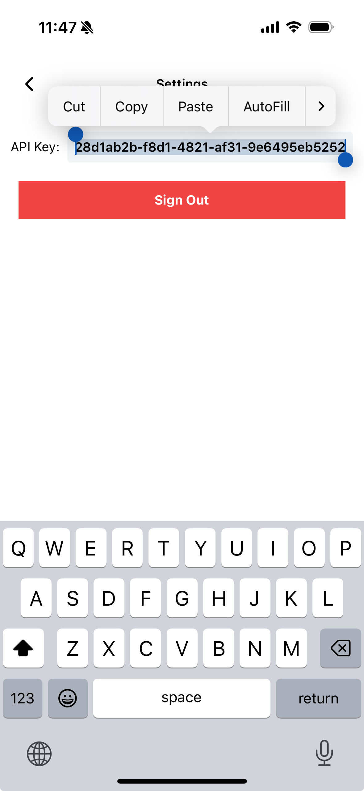
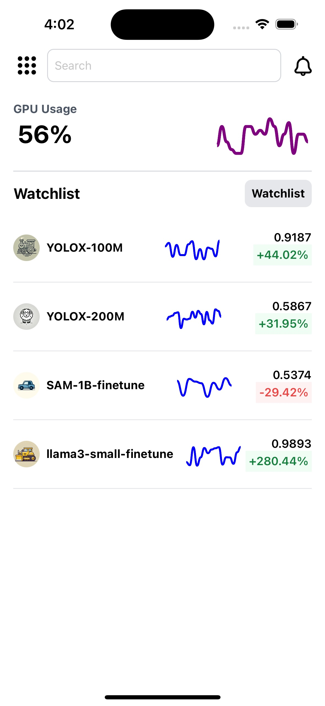
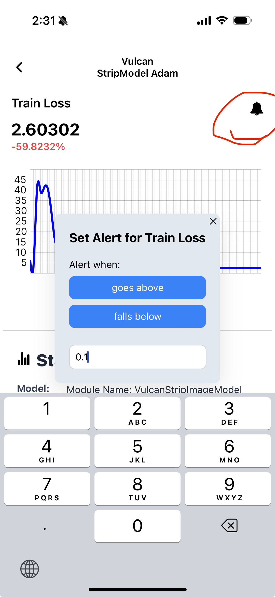

# Supamodel

<div style="margin-bottom: 100px;">
<p align="center">
  
</p>
<p align="center"><strong style="font-size: larger;"><em>Monitor ML experiments on your phone</em></strong></p>
</div>


[App Store](https://apps.apple.com/us/app/supamodel/id6517357968)  


[Website](https://supamodel.ai)


Supamodel is a dead simple Python package that allows users to monitor their machine learning experiments from their mobile phones. It provides functionalities to log metrics, monitor GPU usage, and manage experiments.

To get started, download the mobile app from App Store, currently only ios is supported.

Login using your preferred login method, and go to settings to copy the api key.




## Installation

Install the supamodel python package

```
pip install supamodel-py
```

## Usage

Now you can start using supamodel in your code, here's a basic example:


```
import time
import supamodel

supamodel.login("YOUR_API_KEY")

# config can be any dict object containing the hyperparams you want to track

config = {
    "learning_rate": 0.01,
    "optimizer": "Adam",
    "batch_size": 1024
    # ...
}

supamodel.init(experiment_name="Great Big Model", config=config)

for i in range(1, 100):

    # dummy values
    supamodel.log("train_accuracy", i)
    supamodel.log("val_accuracy", 100 - i)


```

Your experiments now will show up in the app, like this:




You can also set alerts on the metrics to get a notification if it falls below or exceeds a certain amount. Do this by clicking the bell-icon next to the metrics.




## API Reference

### `login`

**Arguments:**
- `api_key` (str): Your API key for authentication.

**Returns:**
- `None`

### `init`

**Arguments:**
- `experiment_name` (str): The name of your experiment.
- `config` (dict): A dictionary containing the hyperparameters you want to track.
- `main_metric` (str, optional): The main metric to monitor. This will be the metric used to generate the preview graph on the experiments page of the app. Defaults to `None`.
- `log_compute` (bool, optional): Whether to log gpu usage. Defaults to `True`. only works on NVIDIA GPU machines that can run the `nvidia-smi` command

**Returns:**
- `None`

### `log`

**Arguments:**
- `metric_name` (str): The name of the metric you want to log. e.g. "val_loss"
- `value` (float): The value of the metric


**Returns:**
- `None`


